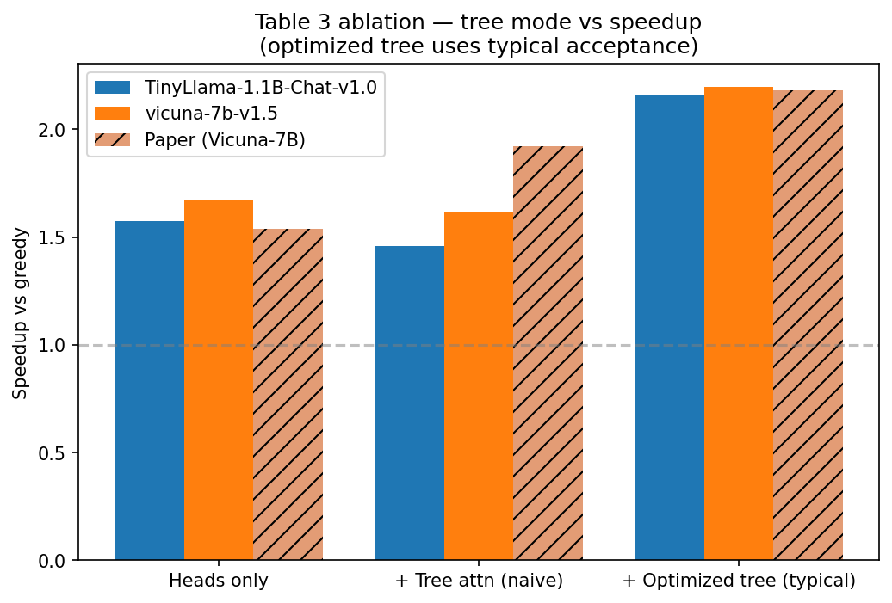

# Reproducing MEDUSA (CS 4782 Final Project)

**Authors:** Huajie Zhong (hz642), Frank Dai (sd924)  
**Institution:** Cornell University (CS 4782, Spring 2026)

## 1. Introduction
Welcome to our final project repo! We built a from-scratch re-implementation of the **MEDUSA** inference acceleration framework ([Cai et al., 2024](https://arxiv.org/abs/2401.10774)). MEDUSA is pretty cool—it speeds up LLM generation by attaching multiple "decoding heads" to a frozen backbone model. These heads draft several future tokens at once, and a tree-attention mechanism verifies them all in a single forward pass. For this project, we specifically focused on reproducing the **MEDUSA-1** setup (where the backbone is frozen and only the heads are trained) on the Vicuna-7B model.

## 2. Chosen Result
We targeted **Section 3.1** of the original paper: achieving a **2.18× wall-clock speedup** on Vicuna-7B compared to standard greedy decoding. 

As a secondary goal, we also reproduced the ablation study in **Table 3**. This let us break down exactly where the speedup comes from by testing the model with just the heads, then adding a naive tree, and finally using their optimized sparse tree.

## 3. GitHub Contents
Here's a quick map of the repository:
```text
.
├── code/               # All the Python source code (model, training, benchmark, utils, etc.)
├── data/               # Instructions on how to get the ShareGPT dataset
├── results/            # Benchmark metrics (JSON) and generated plots (PNG)
├── poster/             # Our in-class presentation poster (LaTeX source & PDF)
├── report/             # The final 2-page project summary report (LaTeX source & PDF)
├── medusa_colab.ipynb  # A lightweight Colab notebook to easily run our scripts
├── requirements.txt    # Python dependencies
├── README.md           # You are here!
└── LICENSE             # MIT License
```

## 4. Re-implementation Details
*   **Models used:** Vicuna-7B-v1.5 (our main target) and TinyLlama-1.1B-Chat-v1.0 (for quick smoke tests).
*   **Dataset:** We used `Aeala/ShareGPT_Vicuna_unfiltered` (specifically the assistant-turn responses). We trained on about 60k samples for the full run.
*   **Architecture:** We added 4 Medusa heads on top of the base model. To ensure stable early training, we used the zero-initialization trick for the first linear layer and cloned the original language modeling head weights for the second layer.
*   **Training:** Since it's MEDUSA-1, the backbone was completely frozen. We trained only the heads using an AdamW optimizer, a cosine learning rate schedule, and a label shift of $k+2$ for each head.
*   **Inference & Tree Attention:** We implemented the static 64-node BFS-pruned tree (branching factors: 10, 3, 2, 2) with a custom ancestor-only attention mask. We also wrote custom KV-cache surgery code to cleanly select the accepted paths. Both greedy and "typical" acceptance algorithms were implemented.
*   **Deviations:** Due to hardware memory limits, we trained $K=4$ heads instead of the paper's 5. We also trained on raw ShareGPT data instead of Vicuna-regenerated responses, and we benchmarked on an A100.

## 5. Reproduction Steps

### Setting up the environment
First, install the required packages:
```bash
pip install -r requirements.txt
```

### Training the heads
You can run a quick smoke test on a smaller GPU (like a T4) just to make sure things work, or run the full 60k sample training if you have an A100/H100:
```bash
python code/train.py --max_samples 1000     # Quick smoke test
python code/train.py --max_samples 60000    # Full paper-scale run
```
This saves the trained head weights to `results/medusa_heads.pt`.

### Benchmarking
To see the speedups for yourself, run the benchmarking script from inside the `code` directory (this ensures outputs go directly to `results/`):
```bash
cd code
python benchmark.py --mode full --model_id lmsys/vicuna-7b-v1.5          # Full comparison run
python benchmark.py --mode table3 --model_id lmsys/vicuna-7b-v1.5        # Re-run the Table 3 ablation
```

### Visualizing results
To generate the bar charts and graphs from our JSON metrics:
```bash
python code/visualize.py
```
Check the `results/` folder for the fresh `.png` files!

## 6. Results & Insights

Here is how our final numbers stacked up against the original paper when running on an A100:

| Configuration (Vicuna-7B) | Original Paper | Our Implementation |
| :--- | :--- | :--- |
| Heads only (no tree) | 1.54× | **1.67×** |
| + Naive tree attention | 1.92× | 1.62× |
| + Optimized tree (greedy) | — | 2.03× |
| + Optimized tree (typical) | **2.18×** | **2.20×** ✓ |
| Head-0 top-1 accuracy | >60% | **64.1%** |
| Acceptance length | 3.47 (MEDUSA-2) | **2.87** |



**Key Takeaway:** We successfully matched the paper's 2.18× speedup target (hitting ~2.20× with typical acceptance)! One really interesting thing we found was that the naive Cartesian tree actually performed *worse* than having no tree at all. This proves that the paper's cleverly pruned sparse tree topology isn't just an optional optimization—it's absolutely critical to getting good performance.

## 7. Conclusion
Overall, we found MEDUSA-1 to be highly reproducible. By carefully implementing the propose-verify-accept loop and their 64-node tree, we successfully met the 2.18× speedup target. The hardest part by far was getting the KV-cache surgery right; a single off-by-one error in the token sequence length would cascade through the position IDs and attention mask, breaking everything. 

Our acceptance length (2.87) fell slightly short of the paper's 3.47 metric, but that number was from MEDUSA-2. We suspect that using Vicuna-regenerated data instead of raw ShareGPT responses would close this final gap, which would be a great next step along with exploring joint fine-tuning (MEDUSA-2).

## 8. References
*   Cai, T., Li, Y., Geng, Z., Peng, H., Lee, J. D., Chen, D., Dao, T. *MEDUSA: Simple LLM Inference Acceleration Framework with Multiple Decoding Heads.* [arXiv:2401.10774](https://arxiv.org/abs/2401.10774), 2024.
*   Touvron, H. et al. *Llama 2: Open Foundation and Fine-Tuned Chat Models.* arXiv:2307.09288, 2023.
*   Wolf, T. et al. *Transformers: State-of-the-Art Natural Language Processing.* EMNLP System Demonstrations, 2020.
*   ShareGPT dataset on HuggingFace: `Aeala/ShareGPT_Vicuna_unfiltered`.

## 9. Acknowledgements
This was built as our final project for **CS 4782 (Deep Learning)** at Cornell University (Spring 2026). A huge thank you to the course staff for their guidance all semester, and to the original MEDUSA authors for writing a great paper and open-sourcing their reference code!
